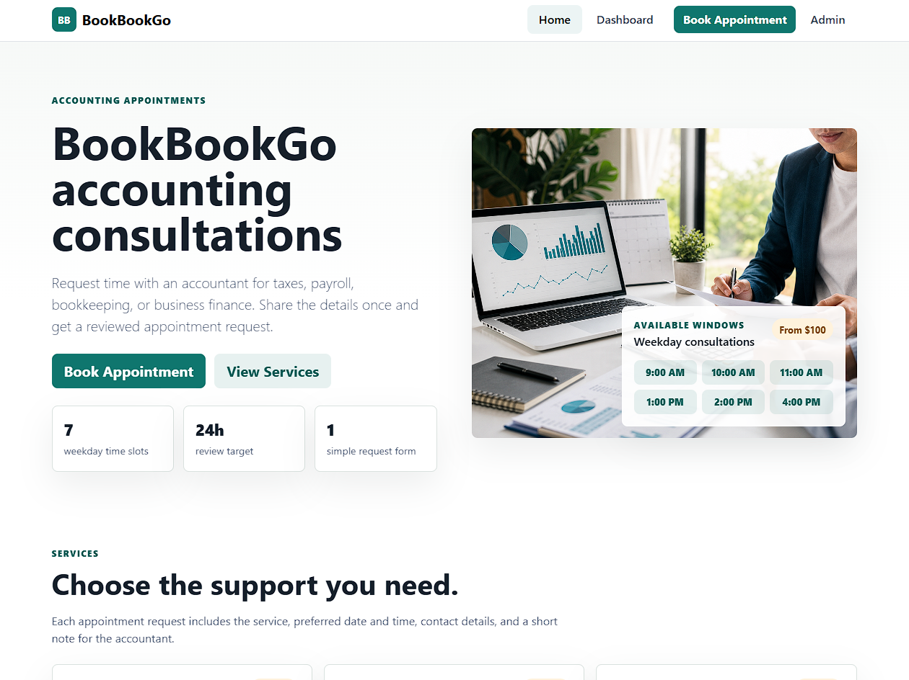
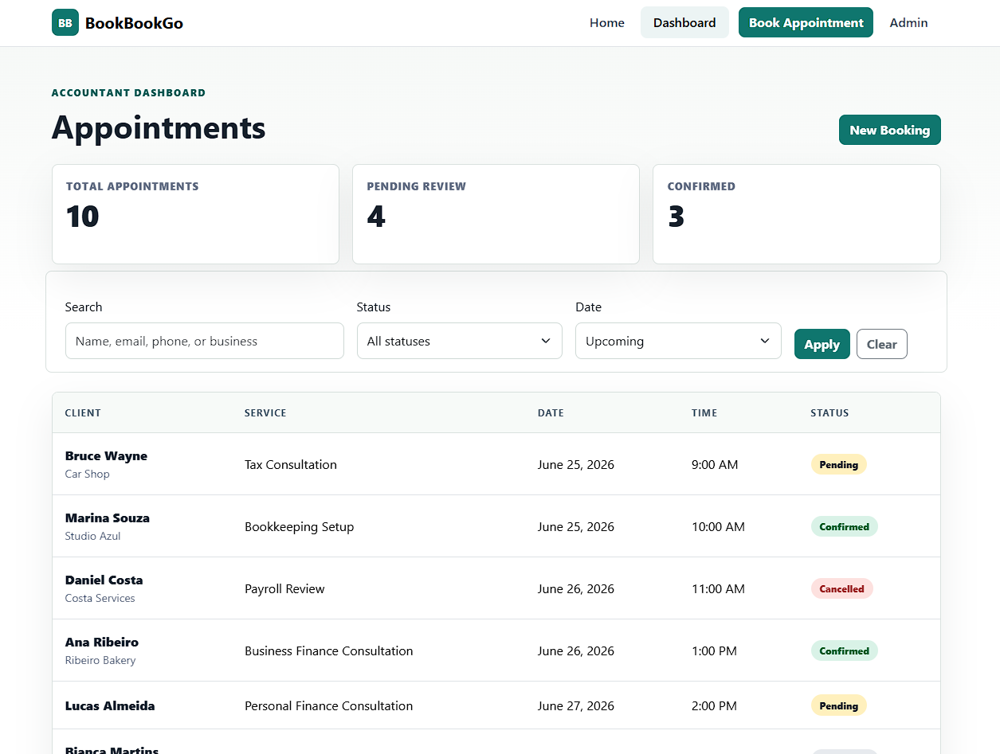

# BookBookGo

A Django booking system for accounting consultations. Clients can request appointments, choose services, select available time slots, and receive email updates. The accountant can manage services, appointments, statuses, and client requests from a protected dashboard.

## Screenshots

<div align="left">
  <p float="left">
    
    
  </p>
</div>

## Features

- Public appointment booking form
- Service management through Django admin
- Active/inactive service control
- Service details with duration and price
- Duplicate booking prevention
- Fixed appointment time slots
- Past date prevention
- Weekend booking prevention
- Booked time slot disabling
- Booking confirmation page
- Multipart HTML and plain-text email notifications using Django email backend
- Accountant dashboard
- Appointment search, status filters, date filters, and pagination
- Appointment detail page
- Status update workflow

## Tech Stack

- Python
- Django
- Bootstrap
- PostgreSQL
- HTML/CSS
- JavaScript

## Main Pages

- `/` - Homepage with available services
- `/book/` - Appointment booking form
- `/booking/success/<id>/` - Booking confirmation
- `/dashboard/` - Accountant dashboard
- `/dashboard/appointments/<id>/` - Appointment detail
- `/admin/` - Django admin

## Setup Instructions

```bash
git clone https://github.com/vfb-dev/bookbookgo.git
cd bookbookgo

python -m venv env
env\Scripts\activate

pip install -r requirements.txt

python manage.py migrate
python manage.py createsuperuser
python manage.py runserver
```

## Author

vfb-dev — Turning ideas into web apps
